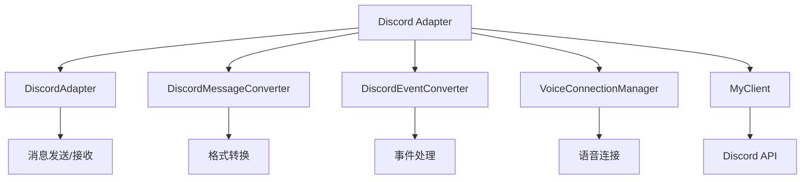
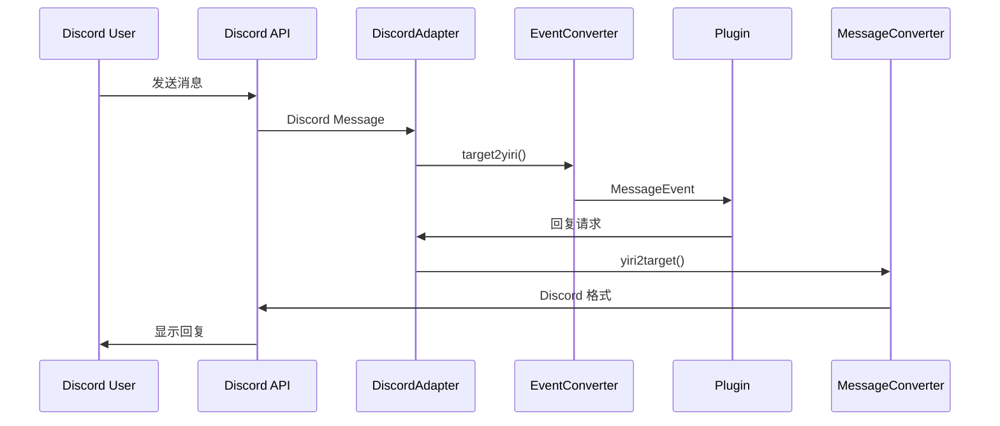
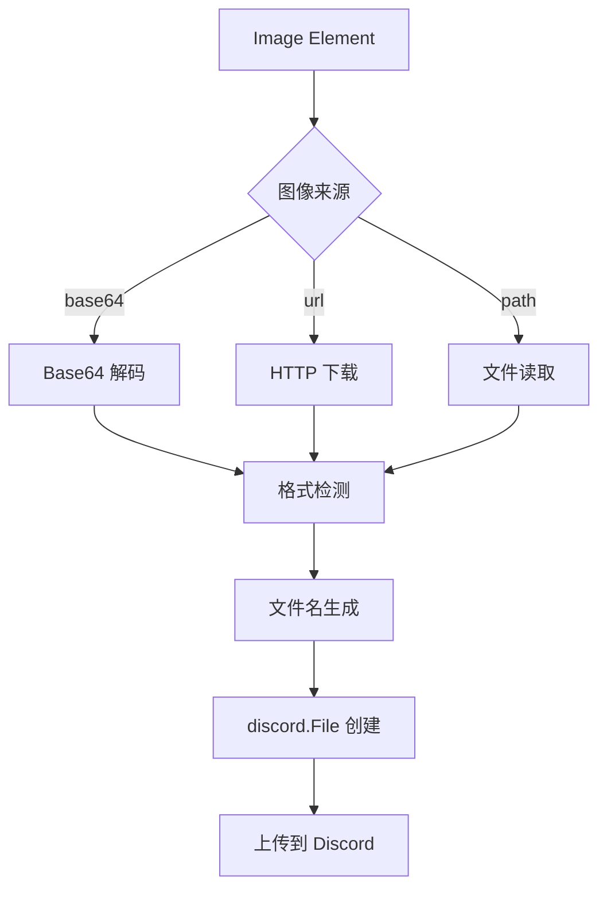
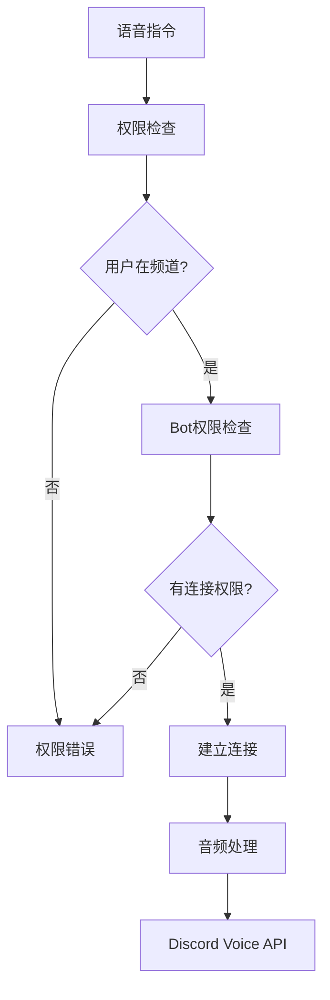

# Discord 适配器文档

## 概述

这是 LangBot 平台的 Discord 适配器完整文档，基于 discord.py 库实现了与 Discord 平台的全面集成，包括文本消息、图像处理、语音功能等完整功能集。

## 文档导航

### 核心文档
- **[API 参考](api_reference.md)** - Discord 适配器完整 API 文档
- **[快速开始](quick_start.md)** - 基本使用指南
- **[架构设计](design.md)** - 适配器架构设计
- **[故障排除](troubleshooting.md)** - 常见问题解决方案

## 完整功能集

### 消息处理
- 文本消息发送和接收
- 图像消息处理（支持多种格式）
- 消息引用和回复
- At 功能支持
- 转发消息处理

### 图像功能
- 多格式图像支持（PNG、JPG、GIF、WebP）
- Base64 编码图像处理
- URL 图像下载和转换
- 本地文件图像读取
- 自动文件类型检测
- 批量图像发送

### 语音功能
- 语音频道连接管理
- 音频播放控制
- 连接状态监控
- 权限验证系统
- 自动连接清理

### 事件系统
- 消息事件处理
- 用户状态监控
- 频道状态变化
- Bot 生命周期管理

## 快速开始

### 环境要求

- **LangBot**: 框架环境

## 系统架构

### 核心组件

### 消息处理流程

### 图像处理流程

### 语音处理流程

## 核心特性详解

### 消息转换器 (DiscordMessageConverter)

负责在 LangBot 内部消息格式和 Discord API 格式之间进行转换：

- **yiri2target**: 将 LangBot MessageChain 转换为 Discord 格式
- **target2yiri**: 将 Discord 消息转换为 LangBot 格式
- 支持文本、图像、转发消息等多种类型

### 图像处理特性

- **多源支持**: Base64、URL、本地文件路径
- **格式检测**: 自动检测 PNG、JPG、GIF、WebP 格式
- **智能命名**: 基于内容和来源的文件命名
- **错误处理**: 优雅处理无效图像和网络错误
- **批量处理**: 单次消息支持多张图像

### 语音连接管理器 (VoiceConnectionManager)

提供完整的语音功能管理：

- **连接池管理**: 多服务器连接状态跟踪
- **权限验证**: 用户和机器人权限检查
- **状态监控**: 连接健康度和延迟监控
- **异常处理**: 分类的异常体系
- **自动清理**: 定期清理无效连接

### 事件系统

- **消息事件**: 处理用户消息和机器人响应
- **状态监控**: 跟踪连接状态变化
- **生命周期**: 管理适配器启动和关闭

## 权限配置

Bot 需要以下 Discord 权限：

- **基础权限**:
  - Read Messages
  - Send Messages
  - Embed Links
  - Attach Files
  - Read Message History

- **语音权限**:
  - Connect
  - Speak
  - Use Voice Activity

---

> **注意**: 本文档基于实际的 discord.py 实现，涵盖了 Discord 适配器的完整功能集。语音功能需要额外的依赖安装，图像功能支持多种来源和格式。详细的使用方法和故障排除请参考其他专门文档。
