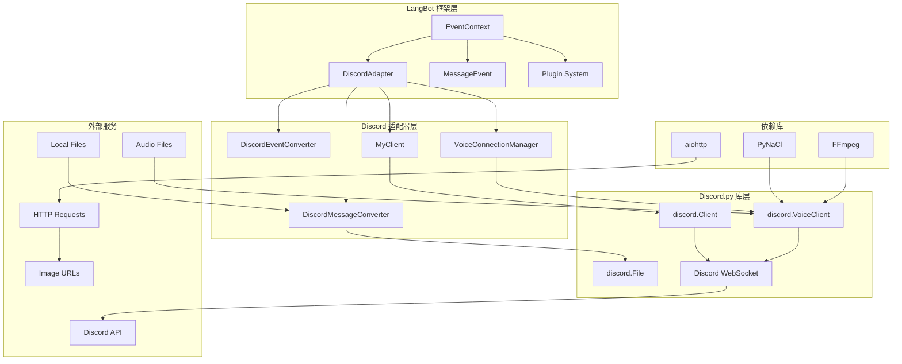
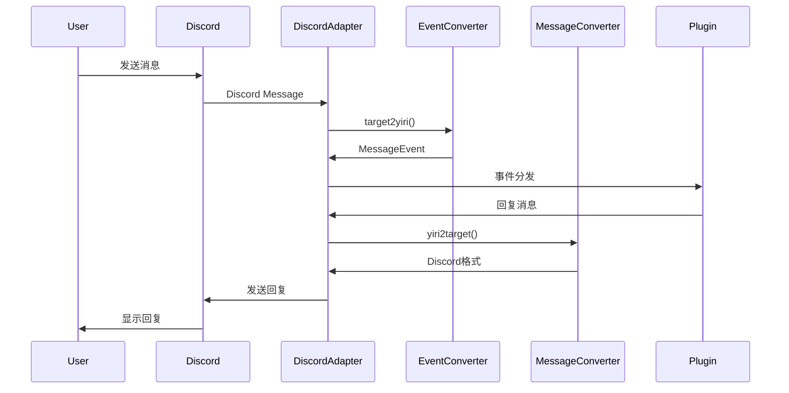
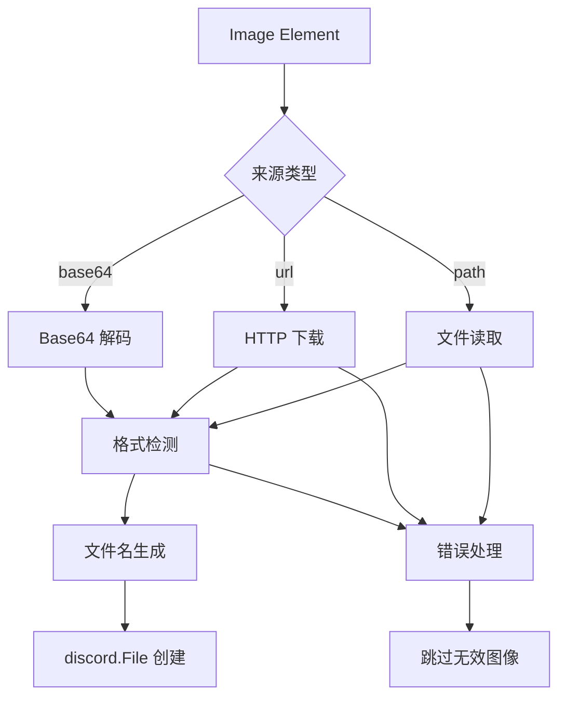
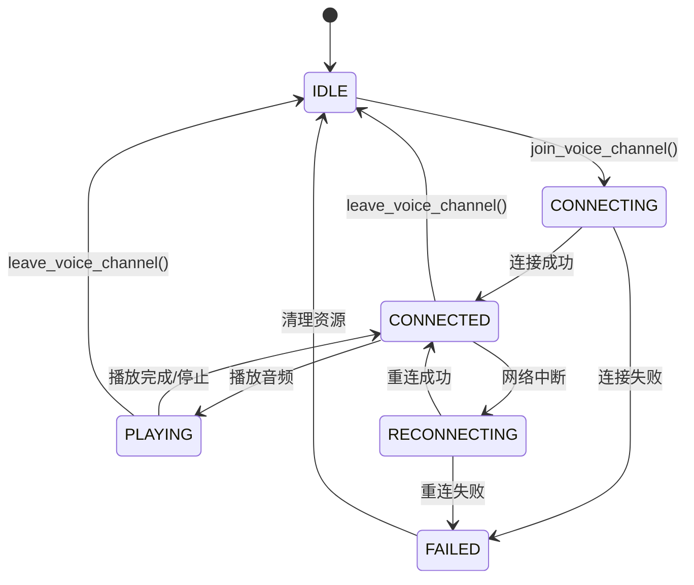
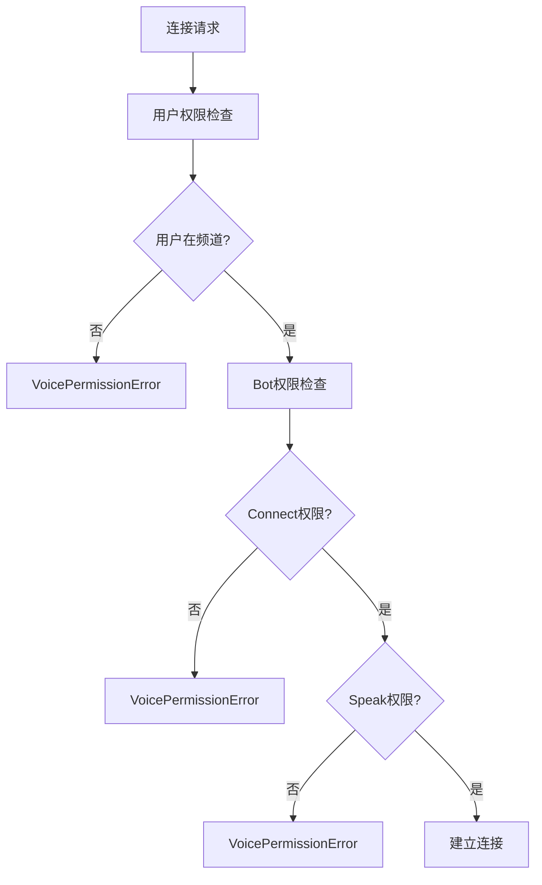
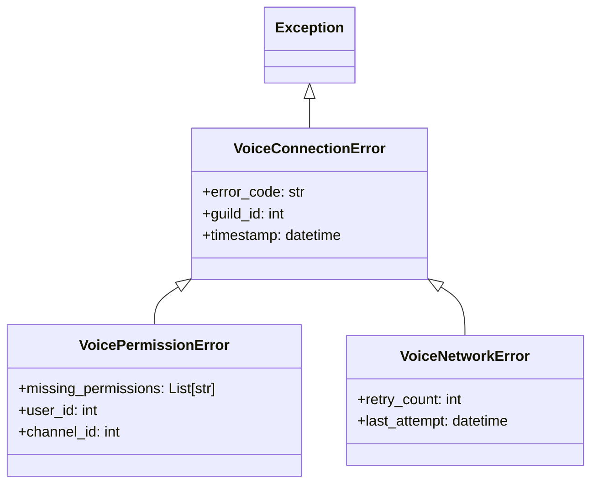

# Discord 适配器架构设计

## 概述

本文档详细描述 LangBot Discord 适配器的架构设计，包括消息处理、图像管理、语音功能等完整系统的设计理念和实现架构。

## 整体架构

### 系统组件图



### 数据流架构



## 核心组件设计

### 1. DiscordAdapter 主适配器

#### 职责
- **连接管理**: 维护与 Discord 的 WebSocket 连接
- **事件路由**: 将 Discord 事件转换并分发到插件系统
- **消息发送**: 处理外发消息的格式转换和发送
- **语音管理**: 协调语音连接的生命周期
- **资源清理**: 管理连接池和内存资源

#### 核心接口
```python
class DiscordAdapter(MessagePlatformAdapter):
    # 消息相关
    async def send_message(target_type: str, target_id: str, message: MessageChain)
    async def reply_message(message_source: MessageEvent, message: MessageChain, quote_origin: bool)
    
    # 语音相关
    async def join_voice_channel(guild_id: int, channel_id: int, user_id: int) -> VoiceClient
    async def leave_voice_channel(guild_id: int) -> bool
    async def get_voice_client(guild_id: int) -> Optional[VoiceClient]
    
    # 管理相关
    async def run_async()
    async def kill() -> bool
```

#### 设计模式
- **适配器模式**: 将 Discord API 适配到 LangBot 接口
- **单例模式**: 每个 Discord 配置对应一个适配器实例
- **观察者模式**: 事件监听和分发机制

### 2. 消息转换器 (DiscordMessageConverter)

#### 设计目标
- **格式无关**: 屏蔽 Discord 和 LangBot 格式差异
- **类型安全**: 保证消息元素类型转换的正确性
- **性能优化**: 减少不必要的数据复制和转换
- **错误恢复**: 优雅处理格式错误和网络异常

#### 转换策略

##### LangBot → Discord (yiri2target)
```python
转换流程:
MessageChain → 解析元素 → 分类处理 → (text: str, files: List[discord.File])

元素处理策略:
- Plain → 文本累加
- Image → 文件对象创建
- At → 移除处理
- Forward → 递归展开
```

##### Discord → LangBot (target2yiri)
```python
转换流程:
discord.Message → 提取内容 → 构建元素 → MessageChain

内容映射:
- message.content → Plain
- message.attachments → Image
- message.embeds → Plain (description)
```

#### 图像处理架构



#### 图像处理特性
- **多源支持**: Base64、URL、本地文件
- **格式智能检测**: 基于内容和元数据
- **异步下载**: 并发处理多个网络图像
- **内存优化**: 使用 BytesIO 避免临时文件
- **错误隔离**: 单个图像失败不影响其他处理

### 3. 语音连接管理器 (VoiceConnectionManager)

#### 设计原则
- **连接复用**: 避免重复连接开销
- **状态一致性**: 维护准确的连接状态
- **权限验证**: 多层次权限检查
- **故障恢复**: 自动重连和清理机制
- **性能监控**: 连接质量实时监控

#### 连接生命周期



#### 连接池设计
```python
class VoiceConnectionManager:
    connections: Dict[int, VoiceConnectionInfo]  # guild_id -> 连接信息
    
    # 连接管理
    async def join_voice_channel() -> VoiceClient
    async def leave_voice_channel() -> bool
    async def get_connection_status() -> Optional[dict]
    
    # 监控和清理
    async def start_monitoring()
    async def cleanup_inactive_connections()
    async def disconnect_all()
```

#### 权限验证架构


### 4. 事件转换器 (DiscordEventConverter)

#### 转换策略
- **事件映射**: Discord 事件到 LangBot 事件的标准化
- **上下文构建**: 构建完整的事件上下文信息
- **用户信息**: 提取和标准化用户身份信息
- **频道信息**: 处理频道和服务器相关信息

#### 事件转换流程
```python
discord.Message 
└── 提取基础信息 (作者、频道、时间)
└── 转换消息内容 (DiscordMessageConverter)
└── 构建查询对象 (Query)
└── 创建发送者对象 (Sender)
└── 生成 MessageEvent
```

## 异常处理设计

### 异常体系架构



### 错误处理策略
- **分层处理**: 不同层次处理不同类型的错误
- **优雅降级**: 单个功能失败不影响整体系统
- **用户友好**: 提供清晰的错误信息和解决建议
- **日志记录**: 完整的错误追踪和调试信息

## 性能设计

### 内存管理
- **连接池**: 复用语音连接减少开销
- **图像缓存**: 临时图像数据及时清理
- **异步处理**: 避免阻塞主事件循环
- **资源限制**: 控制并发连接和文件大小

### 并发设计
- **异步架构**: 全面采用 async/await
- **连接锁**: 防止语音连接竞态条件
- **批量处理**: 图像和消息的批量操作
- **错误隔离**: 单个操作失败不影响其他操作

### 缓存策略
```python
# 连接状态缓存
connections: Dict[int, VoiceConnectionInfo]

# 临时数据缓存
image_cache: Dict[str, bytes]  # URL -> 图像数据
channel_cache: Dict[int, discord.Channel]  # 频道对象缓存
```

## 扩展性设计

### 插件接口
- **标准化事件**: 提供统一的事件接口
- **类型安全**: 强类型的消息元素系统
- **回调机制**: 灵活的事件监听和处理
- **生命周期**: 完整的插件生命周期管理

### 配置管理
```python
# 适配器配置
class DiscordConfig:
    client_id: str
    token: str
    proxy: Optional[str]
    voice_enabled: bool = True
    image_max_size: int = 25 * 1024 * 1024  # 25MB
    max_concurrent_downloads: int = 5
```

### 监控接口
- **连接状态**: 实时语音连接状态
- **性能指标**: 延迟、吞吐量等指标
- **错误统计**: 各类错误的统计和趋势
- **资源使用**: 内存、连接数等资源监控

## 测试设计

### 单元测试架构
```python
# 消息转换测试
class TestDiscordMessageConverter:
    async def test_yiri2target_text()
    async def test_yiri2target_images()
    async def test_target2yiri()

# 语音功能测试
class TestVoiceConnectionManager:
    async def test_join_voice_channel()
    async def test_permission_validation()
    async def test_connection_cleanup()

# 适配器集成测试
class TestDiscordAdapter:
    async def test_message_sending()
    async def test_event_handling()
    async def test_voice_integration()
```

### 模拟测试
- **Mock Discord API**: 模拟 Discord 服务器响应
- **虚拟语音频道**: 测试语音功能无需真实连接
- **错误注入**: 测试各种异常情况的处理
- **性能测试**: 并发和高负载测试

## 部署架构

### 环境要求
- 与LangBot相同

## 监控和维护

### 日志设计
```python
# 分级日志
logger.debug("详细调试信息")
logger.info("一般操作信息")
logger.warning("警告信息")
logger.error("错误信息")
logger.critical("严重错误")

# 结构化日志
{
    "timestamp": "2025-07-04T10:30:00Z",
    "level": "INFO",
    "component": "VoiceConnectionManager",
    "action": "join_voice_channel",
    "guild_id": 123456789,
    "channel_id": 987654321,
    "latency": 45.2,
    "status": "success"
}
```

### 健康检查
- **连接状态**: Discord WebSocket 连接健康度
- **语音质量**: 语音连接延迟和稳定性
- **资源使用**: 内存和连接池状态
- **错误率**: 各类操作的成功率统计

### 故障恢复
- **自动重连**: WebSocket 连接断开后自动重连
- **连接清理**: 定期清理无效的语音连接
- **错误重试**: 网络错误的智能重试机制
- **降级服务**: 语音功能异常时的降级策略

---

> **设计原则**: 本架构设计遵循模块化、可扩展、高性能的原则，确保 Discord 适配器能够稳定、高效地处理各种类型的消息和连接需求。
